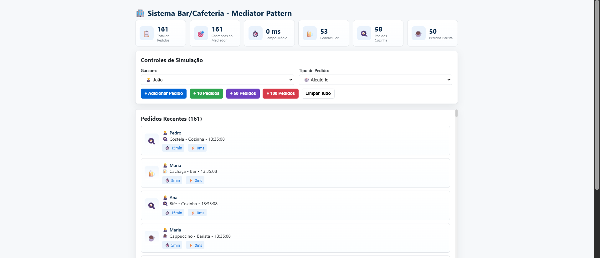
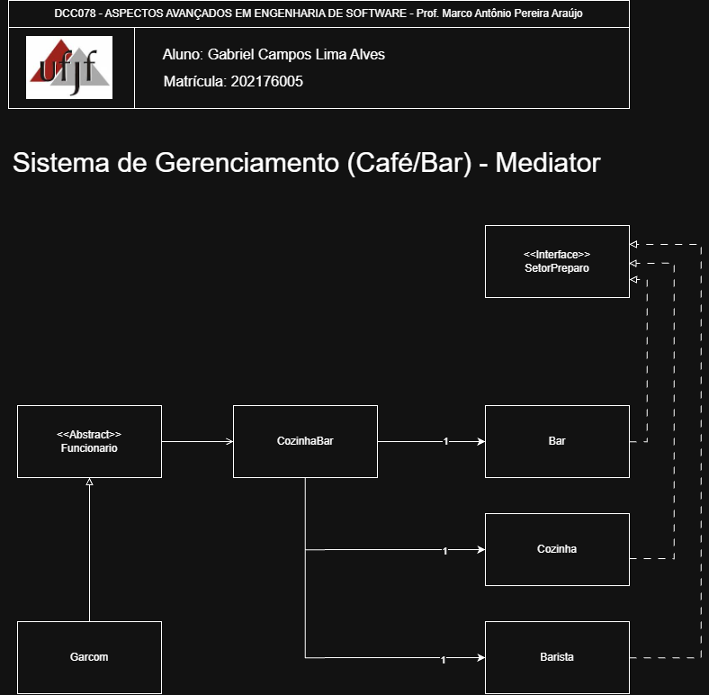

# Mediator — Sistema de Bar e Cafeteria

<p align="center">
	<a href="https://www.ufjf.br/" rel="noopener">
		
	</a>
</p>

<h3 align="center">DCC078-2025.3-A — Aspectos Avançados em Engenharia de Software (UFJF/ICE)</h3>

---

## 📝 Sumário
- [Sobre](#sobre)
- [Diagrama de Classe](#diagrama)
- [Funcionalidades](#funcionalidades)
- [Tecnologias](#tecnologias)
- [Exemplo de Uso](#exemplo)
- [Como Executar e Testes](#testes)
- [Autor](#autor)

## 🧐 Sobre <a name="sobre"></a>
> **Disciplina:** DCC078 – Aspectos Avançados em Engenharia de Software   </br>
> **Projeto:** Demonstração do padrão Mediator em um sistema de bar e cafeteria   </br>
> **Docente:** Prof. Marco Antônio Pereira Araújo  </br>
> **Data de entrega:** 18/11/2025   </br>
> **Aluno:** [Gabriel Campos Lima Alves](#autor)  </br>

### Padrão Mediator
Implementação do padrão **Mediator** aplicada a um sistema de bar e cafeteria. O foco é centralizar a comunicação entre múltiplos objetos (garçons e setores de preparo), reduzindo o acoplamento e facilitando a manutenção. Demonstra:
- Um mediador central (`CozinhaBar`) que gerencia toda comunicação entre funcionários e setores
- Desacoplamento completo entre garçons e setores de preparo
- Padrão Singleton para garantir única instância do mediador e dos setores
- Roteamento inteligente de pedidos para o setor correto
- Interface interativa com visualização em tempo real

Também há uma interface web de demonstração interativa incluída: [Interface de Demonstração](https://camposcodes.github.io/PadroesComportamentais-Mediator/)
<p align="center">
	
</p>

## 📐 Diagrama de Classe <a name="diagrama"></a>
O diagrama abaixo representa a arquitetura do projeto, enfatizando o padrão **Mediator** como centralizador de comunicação:
<p align="center">
	
</p>

## 🚀 Funcionalidades <a name="funcionalidades"></a>
### Sistema de Bar e Cafeteria
- **Funcionario**: Classe base que representa um funcionário do estabelecimento
- **Garcom**: Subclasse que herda capacidades de comunicação via mediador
- **SetorPreparo**: Interface que define o contrato para todos os setores
- **Bar, Cozinha, Barista**: Implementações concretas de `SetorPreparo` como Singletons
- **CozinhaBar**: Mediador central que:
  - Centraliza toda comunicação entre garçons e setores
  - Roteia pedidos para o setor correto
  - Verifica disponibilidade dos setores
  - Obtém tempos estimados de preparo

### Recursos
- ✅ Implementação completa do padrão Mediator
- ✅ Padrão Singleton para mediador e setores
- ✅ Desacoplamento total entre garçons e setores
- ✅ Sistema de roteamento de pedidos por tipo
- ✅ Verificação de disponibilidade dos setores
- ✅ Cálculo de tempos estimados de preparo
- ✅ Cobertura completa de testes com JUnit 5
- ✅ Interface web interativa com animações

##  Tecnologias <a name="tecnologias"></a>
- **Java 11+**
- **JUnit 5** - Framework de testes
- **Maven** - Gerenciamento de dependências
- **HTML5/CSS3/JavaScript** - Interface web
- **Git** - Controle de versão

## 📊 Exemplo de Uso <a name="exemplo"></a>
```java
// Criando garçom
Garcom garcom = new Garcom();

// Solicitando bebida alcoólica ao mediador
String resultado1 = garcom.solicitarBebidaAlcoolica("Cerveja gelada");
System.out.println(resultado1);

// Solicitando alimento à cozinha
String resultado2 = garcom.solicitarAlimento("Feijoada");
System.out.println(resultado2);

// Solicitando bebida especial ao barista
String resultado3 = garcom.solicitarBebistaEspecial("Cappuccino com canela");
System.out.println(resultado3);

// Verificando disponibilidade dos setores
CozinhaBar mediador = CozinhaBar.getInstancia();
System.out.println(mediador.verificarDisponibilidadeSetores());

// Obtendo tempos estimados
System.out.println(mediador.obterTemposEstimados());
```

**Saída esperada:**
```
Cozinha/Bar recebeu o pedido.
Encaminhando para o Bar conforme pedido a seguir.
>>O Bar está preparando a bebida alcoólica: Cerveja gelada

Cozinha/Bar recebeu o pedido.
Encaminhando para a Cozinha conforme pedido a seguir.
>>A Cozinha está preparando o alimento: Feijoada

Cozinha/Bar recebeu o pedido.
Encaminhando para o Barista conforme pedido a seguir.
>>O Barista está preparando a bebida especial: Cappuccino com canela

Status dos Setores:
Bar: Disponível
Cozinha: Disponível
Barista: Disponível

Tempos Estimados de Preparo:
Bar: 3 minutos
Cozinha: 15 minutos
Barista: 5 minutos
```

## 🧪 Como Executar e Testes <a name="testes"></a>
### Pré-requisitos
- Java 11 ou superior
- Maven 3.6+

### Comandos
```bash
# Compilar o projeto
mvn clean compile

# Executar todos os testes
mvn test

# Executar teste específico (exemplo)
mvn test -Dtest=br.com.barcafeteria.padrao.mediator.FuncionarioTest

# Empacotar
mvn package
```

### Testes Inclusos
- **FuncionarioTest**: 6 testes unitários
- **GarcomTest**: 4 testes unitários
- **BarTest**: 7 testes unitários
- **CozinhaTest**: 7 testes unitários
- **BaristaTest**: 7 testes unitários
- **CozinhaBarTest**: 10 testes unitários
- **IntegracaoMediatorTest**: 8 testes de integração

Total: **49 testes** garantindo cobertura completa do padrão Mediator

### Interface Web de Demonstração
1. Abra o arquivo `index.html` em um navegador web
2. Selecione um garçom, tipo de pedido e descrição
3. Clique em "Enviar Pedido" para visualizar:
   - Animações de comunicação entre garçons e setores
   - Log de pedidos processados em tempo real
   - Estatísticas do sistema

## 👨‍💻 Autor <a name="autor"></a>
**Gabriel Campos Lima Alves**
Matrícula: 202176005
Email: campos.gabriel@estudante.ufjf.br
GitHub: [@CamposCodes](https://github.com/CamposCodes)

---

*Projeto de uso acadêmico exclusivo para a disciplina DCC078 - UFJF*
